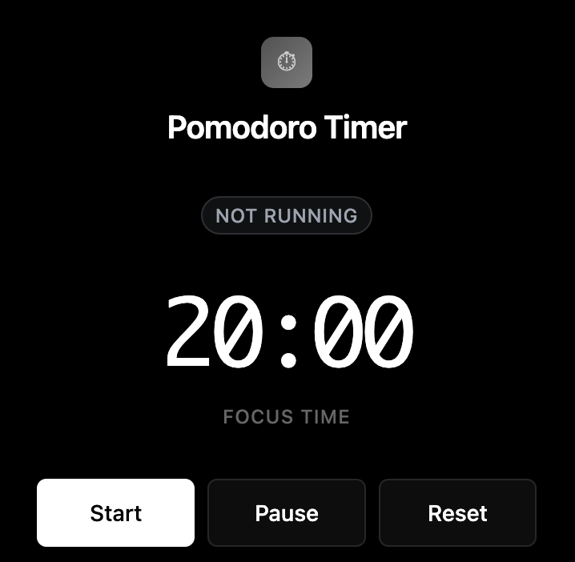
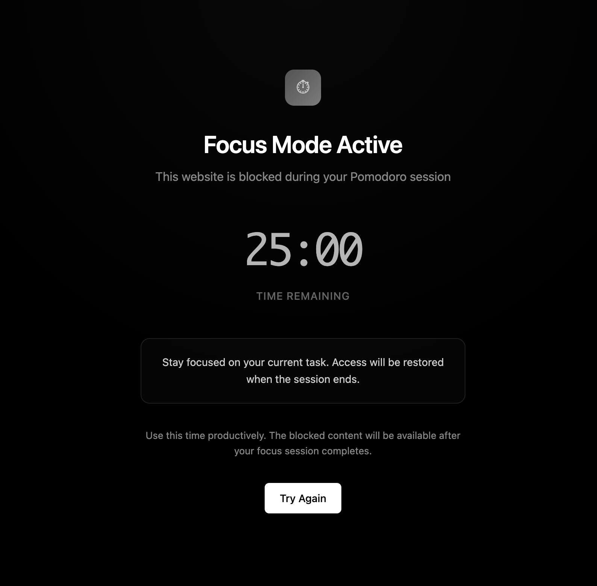

# Pomodoro Website Blocker Extension

*Popup interface for managing your focus sessions*

A Chrome extension that helps you stay focused by blocking distracting websites during Pomodoro timer sessions. Boost your productivity with timed focus sessions and eliminate distractions.

## Features

- ⏰ **25-minute Pomodoro timer** that continues running even when the popup is closed
- 🚫 **Website blocking** functionality to prevent access to distracting sites
- 🎨 **Clean, modern UI** with dark theme for comfortable viewing
- 🔁 **Auto-loop mode** for continuous focus and break cycles
- 📱 **Real-time timer display** on both popup and blocked pages
- 💾 **Persistent storage** of blocked websites between sessions
- 🔄 **Pause and reset** functionality for flexible timer control

## Installation

1. **Download or clone** this repository to your local machine
2. Open **Google Chrome** and navigate to `chrome://extensions`
3. Enable **"Developer mode"** in the top right corner
4. Click **"Load unpacked"** and select the extension folder
5. The extension icon will appear in your toolbar

## How to Use

### Starting a Focus Session

1. Click the extension icon in your toolbar to open the popup
2. Add websites you want to block during focus sessions (e.g., facebook.com, twitter.com)
3. Click "Start" to begin a 25-minute Pomodoro session
4. During the session, attempts to visit blocked websites will be redirected
5. When the timer ends, website access is automatically restored

### Managing Blocked Websites

- Enter a website URL in the input field and click "Add" to block it
- Click "Remove" next to any website to unblock it
- Blocked websites are stored and persist between sessions

### Timer Controls

- **Start**: Begin a new Pomodoro session
- **Pause**: Temporarily pause the timer
- **Reset**: Reset the timer to the default time (25 minutes)

### Timer Settings

Click on "Timer Settings" to expand the settings panel:

- Adjust focus time duration (1-180 minutes)
- Enable auto-loop for continuous focus/break cycles

## Screenshots

### Popup Interface

*Main popup interface showing timer controls and blocked websites management*

### Blocked Page

*Page shown when trying to access a blocked website during a focus session*

## How It Works

The extension uses Chrome's webRequest API to intercept navigation requests. The timer logic runs in the background script, ensuring it continues to operate even when the popup is closed. When the Pomodoro timer is active, any attempt to visit a blocked website will be redirected to a blocking page that shows the remaining time and provides information about the focus session.

Once the timer completes, website access is automatically restored.

## Troubleshooting

If websites are not being blocked:

1. Make sure the Pomodoro timer is running (the status should show "Focus Time")
2. Check that you've added the correct website URLs to the blocked list
3. Try reloading the extension:
   - Go to `chrome://extensions`
   - Find "Pomodoro Website Blocker"
   - Click the refresh icon

## Privacy

This extension stores your blocked website list locally in your browser. No data is sent to external servers.

## Development

To modify this extension:

1. Clone the repository
2. Make your changes
3. Reload the extension in Chrome (`chrome://extensions` → Reload button)

### Key Files

- `manifest.json` - Extension configuration
- `popup.html` - Popup UI
- `popup.js` - Popup functionality
- `background.js` - Background timer and blocking logic
- `blocked.html` - Page shown when accessing blocked websites

## Contributing

Feel free to fork this repository and submit pull requests with improvements or bug fixes.

## License

This project is open source and available under the [MIT License](LICENSE.md).
